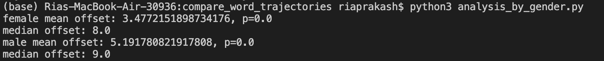
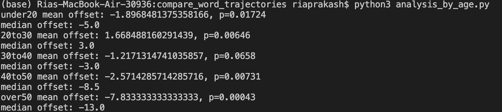

# COG403-songlyrics

## Week 1: Monday, March 1 - Sunday, March 7

Goals to get done by this week:
Download and preprocess the Musixmatch dataset (Ben)
Determine how to get word graphs from Ngram dataset (Ben)
Scrape Wikipedia for artist years of birth (Ria)
Tag and split corpus based on gender of artist (Ria)
    
## Week 2: Monday, March 8 - Sunday, March 14

Goals:
Implement time series analysis of word frequencies in Ngram viewer and lyrics
Also do it by genre

## Week 3: Monday, March 15 - Sunday, March 21

Goals:
Analyse artists by gender

## Week 4: Monday, March 21 - Sunday, March 28

Goals:
Review results and decide which to report

**Gender Analysis Result:**

- Since the offsets are positive in both cases, books were ahead of songs in both cases
- Since the offset for females is smaller than for males, female artists introduce new words into their lyrics more frequently than male artists
- Since the p values are 0, these are statistically significant values

**Age Analysis Result:**

- Mean offset is negative for every group other than 20to30, which means songs were ahead of books in these cases
- and in age 20to30 songs were behind books
- The value is not significant for group 30to40, but is significant for all others

## Week 5: Monday, March 29 - Sunday, April 4

Goals:
Write Report

## Week 6: Monday, April 5 - Sunday, April 11

Goals:
Prep for presentation

Project Report Due April 12
